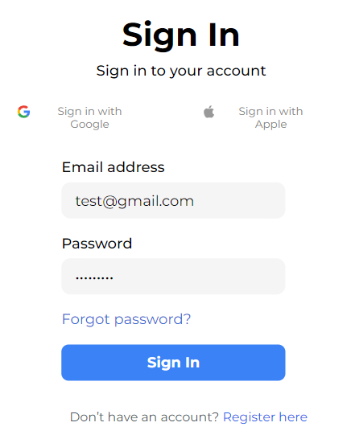

# OpeninApp Dashboard

OpeninApp is a tool designed to enhance user experiences on social media platforms by ensuring that all social media links open in the intended apps. This dashboard is a pixel-perfect implementation of the high fidelity design provided, built using React.js, Tailwind CSS, and Firebase for Google authentication.


## Features

- **Google Authentication:** Users can authenticate and sign up using their Google accounts, powered by Firebase.

- **Responsive Design:** The dashboard is fully responsive, ensuring a seamless experience across various devices and screen sizes.

- **Profile Functionality:** Users can manage their profiles within the dashboard, enhancing the personalized experience.

- **Interactive Charts:** Interactive charts display data using dummy data fetched via Axios/Fetch. The charts provide a visual representation of essential metrics.




## How to Use

To use this project locally, follow these steps:

1. **Clone the Repository:**
 ```bash
    git clone https://github.com/Ayushhgupta39/openinapp
    cd openinapp-dashboard
``` 

2. **Install Dependencies:**
```
npm install
```

3. **Set Up Firebase:**
- Create a Firebase project and configure it in your project.
- Enable Google authentication in the Firebase console.
- Update the Firebase configuration in src/firebase.js.

4. **Run the Application:**
```npm start```

The application will start on http://localhost:3000.

## Deployment

The project is deployed on Vercel and can be accessed at [Live Demo](https://ayush-openinapp.vercel.app/).

## Contact
For any inquiries, please contact us at ayushgupta3902@gmail.com.

***Note***: This project is a part of a screening assignment for the position of React.js Developer Intern at OpeninApp. The implementation is based on the provided design and requirements, showcasing skills in React.js, Tailwind CSS, and Firebase authentication.